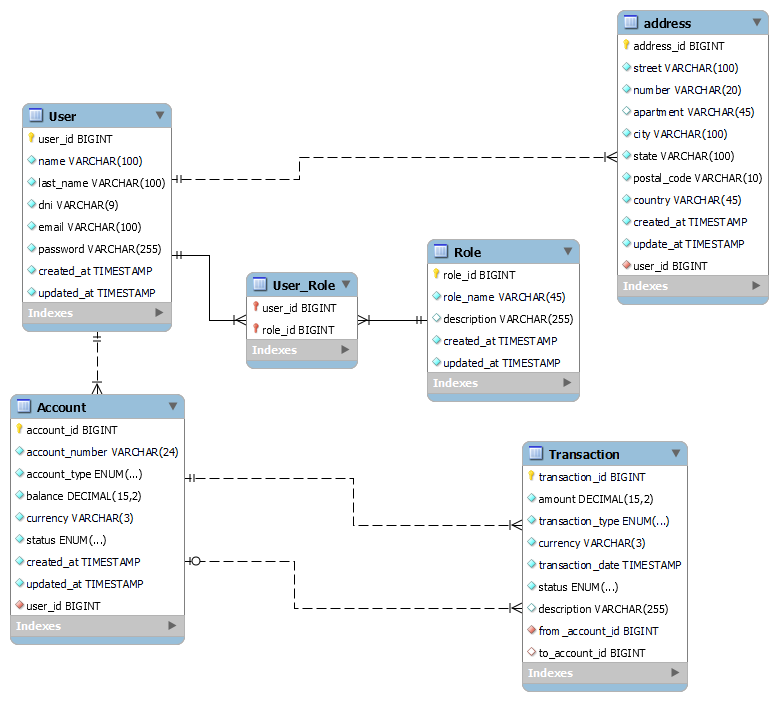

# simple-bank-app
## Planificación: Objetivos y Alcance del Proyecto
### **Objetivo del proyecto:** 
Crear una aplicación web que permita a los 
usuarios realizar operaciones bancarias básicas: consultar su saldo, 
realizar transferencias y visualizar el historial de transacciones. 
El backend será la principal prioridad en términos de lógica y arquitectura, 
mientras que el frontend será básico y servirá como interfaz de 
usuario para probar las funcionalidades.

### **Alcance del Proyecto:**
* **Registro e inicio de sesión:** Permitir que los usuarios creen una cuenta, se 
autentiquen y gestionen su sesión de forma segura.
* **Consulta de saldo y movimientos:** Mostrar el saldo de la cuenta y un historial 
de transacciones.
* **Transferencias de dinero:** Permitir transferencias entre usuarios de la aplicación.
* **Gestión de cuenta:** Incluir funciones básicas de gestión de cuenta, 
como datos de perfil.

### Entregables Iniciales:
* **Backend:** API RESTful con endpoints para registros, autenticación, consulta de 
saldo y movimientos, y transferencias.
* **Fronted Básico:** Páginas HTML con formularios para cada funcionalidad principal.
* **Documentación:** UML y diagramas de base de datos, además de una guía de instalación y ejecución.
## Análisis: Requisitos y Arquitectura del Sistema
### Requisitos del Sistema
**Funcionales**:
* Registrar usuarios con un formulario de registro.
* Iniciar sesión de usuarios para que obtenga un token de sesión o autenticación.
* Consultar saldo y ver movimientos de cuenta.
* Realizar transferencias entre cuentas de usuarios registrados.
* Guardar cada transacción en una base de datos para generar un historial.

**No funcionales:**
* Utilizar JWT para la autenticación.
* Almacenar datos en una base de datos relacional.
* Arquitectura REST que permita extender la aplicación en el futuro.
### Arquitectura del Backend
Se optará por una arquitectura RESTful para el backend con los siguientes componentes clave:
* **Controladores (Controllers):** Gestionan la lógica de los endpoints.
* **Servicios (Services):** Realizan la lógica del negocio.
* **Entidades (Entities):** Representan las entidades de la base de datos.
* **Repositorio (Repository):** Gestión de la base de datos con consultas CRUD.

**Tecnologías que se van a usar:**
* **Backend:** Java y Spring Boot.
* **Base de datos:** MySQL.
* **Autenticación:** JWT.

**Endpoints (Provisional):**

| Método HTTP | Endpoint              | Funcionalidad                    |
|-------------|-----------------------|----------------------------------|
| POST        | /register             | Registro de usuario              |
| POST        | /login                | Inicio de sesión                 |
| GET         | /account/balance      | Consulta de saldo                |
| GET         | /account/transactions | Ver historial de transacciones   |
| POST        | /account/transfer     | Realizar transferencia de dinero |

## Diseño: Diagrama UML y Mockups Básicos
### Diagrama de Entidad-Relación

### **La aplicación podría escalar creando las siguientes tablas junto con su lógica:**
* **Loan:** Para incluir la funcionalidad de préstamos o créditos.
* **Transaction_Fee:** Para cobrar tarifas o comisiones por cierto tipos de transacciones
* **Audit_Log**: Para llevar un registro de las actividades en el sistema.
* **Notification:** Para que los usuarios reciban notificaciones acerca de actividades en sus cuentas.
* **Card:** Para manejar tarjetas bancarias.

